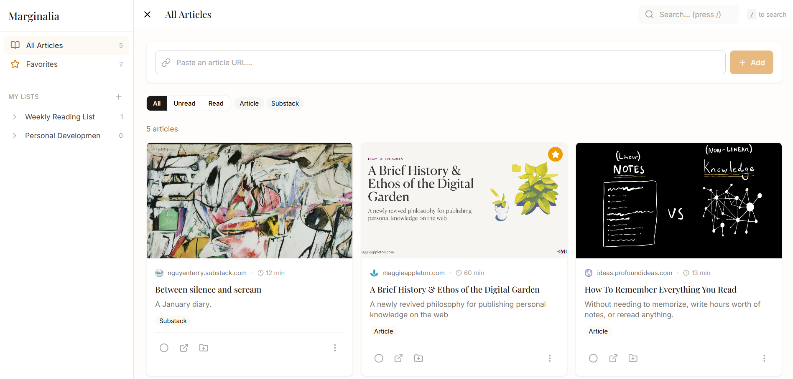

# Marginalia

A clean, minimal reading list manager for saving and organizing articles and Substacks.



## Features

- **Save Articles** — Paste any URL to automatically extract title, description, image, and reading time
- **Organize with Lists** — Create custom reading lists to organize articles by topic or mood
- **Track Progress** — Mark articles as read/unread and star your favorites
- **Search & Filter** — Find articles quickly with search, read status, and tag filters
- **Local Storage** — All data stored locally in your browser using IndexedDB
- **Responsive Design** — Works beautifully on desktop, tablet, and mobile

## Tech Stack

- **Frontend:** React 18, Vite, Tailwind CSS
- **Storage:** IndexedDB via Dexie.js
- **API:** Vercel Serverless Functions
- **Deployment:** Vercel

## Getting Started

### Prerequisites

- Node.js 18+
- npm or yarn

### Installation
```bash
# Clone the repository
git clone https://github.com/YOUR_USERNAME/marginalia.git
cd marginalia

# Install dependencies
npm install

# Run development server
npm run dev
```

### Development with API

To test the metadata extraction API locally:
```bash
npx vercel dev
```

This runs both the Vite dev server and serverless functions.

## Project Structure
```
marginalia/
├── api/                    # Serverless functions
│   └── extract-metadata.js # URL metadata extraction
├── src/
│   ├── components/         # React components
│   │   ├── articles/       # Article card, grid, input
│   │   ├── filters/        # Search and filter bar
│   │   ├── layout/         # Header, sidebar, layout
│   │   ├── lists/          # List modals and selector
│   │   └── ui/             # Reusable UI components
│   ├── context/            # React context (app state)
│   ├── hooks/              # Custom hooks (useArticles, useLists)
│   ├── pages/              # Page components
│   ├── services/           # API service functions
│   └── db.js               # Dexie database setup
├── public/                 # Static assets
└── index.html              # HTML entry point
```

## Keyboard Shortcuts

- `/` — Focus search bar
- `Escape` — Close modals and popovers

## Future Roadmap

- [ ] Browser extension for one-click saving
- [ ] Notes and highlights on articles
- [ ] Cloud sync with user accounts
- [ ] Import/export functionality
- [ ] Dark mode

## License

MIT

## Author

Built by Sharon as a learning project.